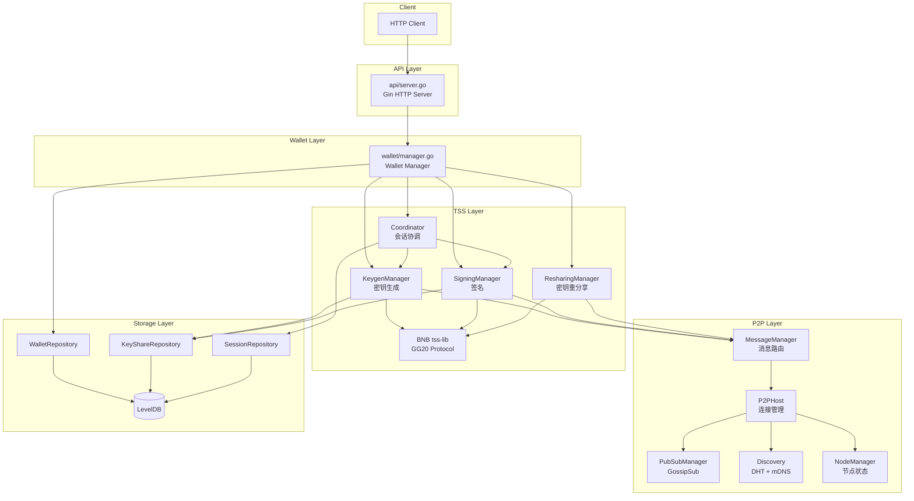
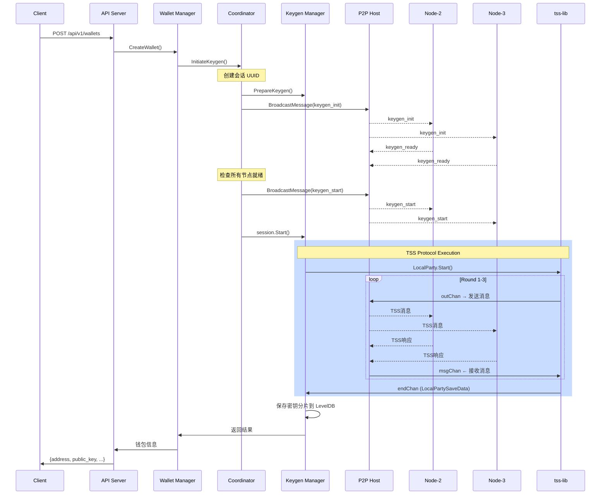
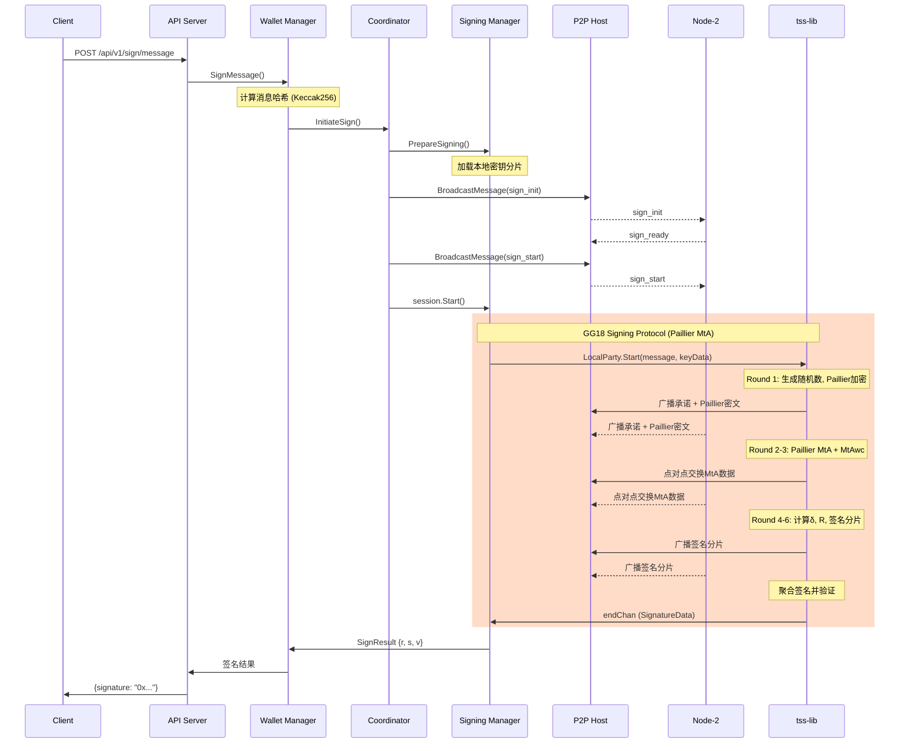
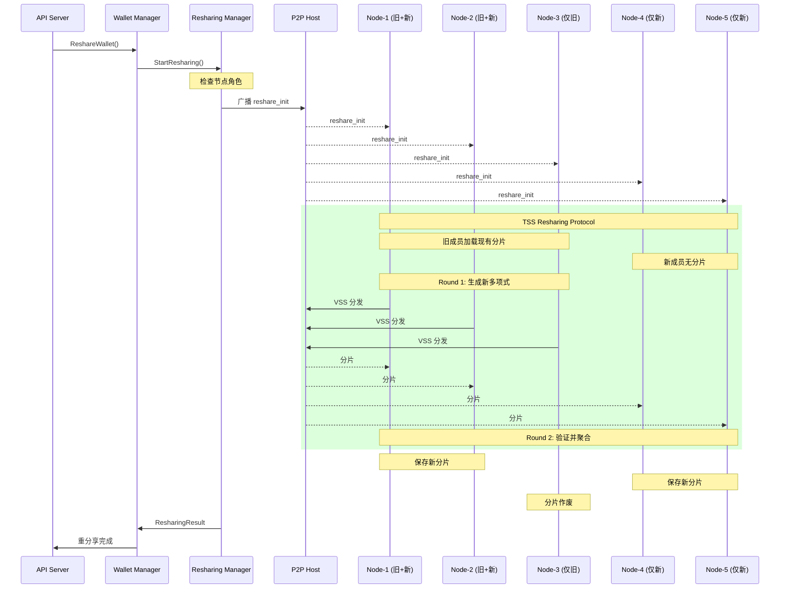
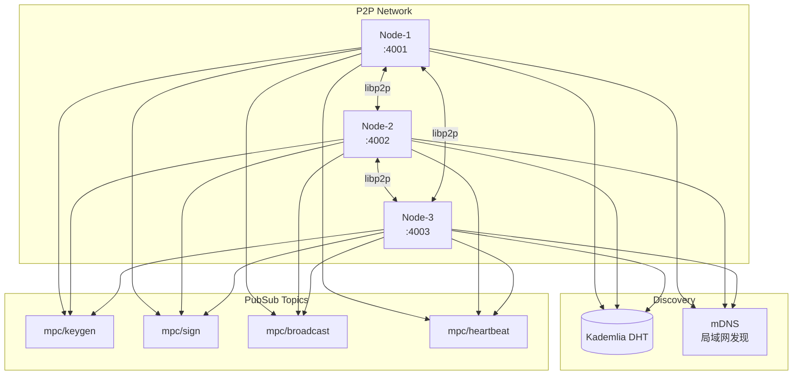
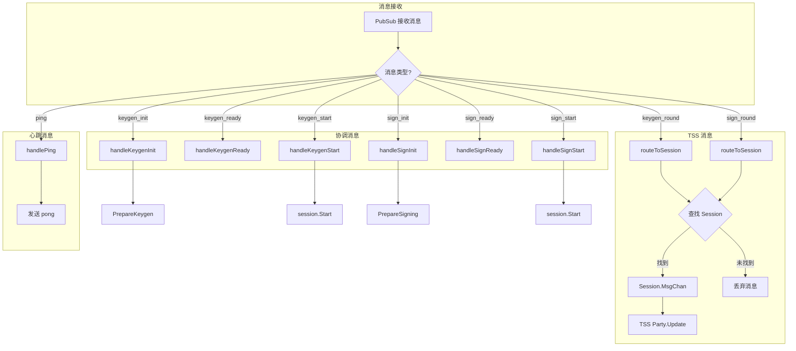
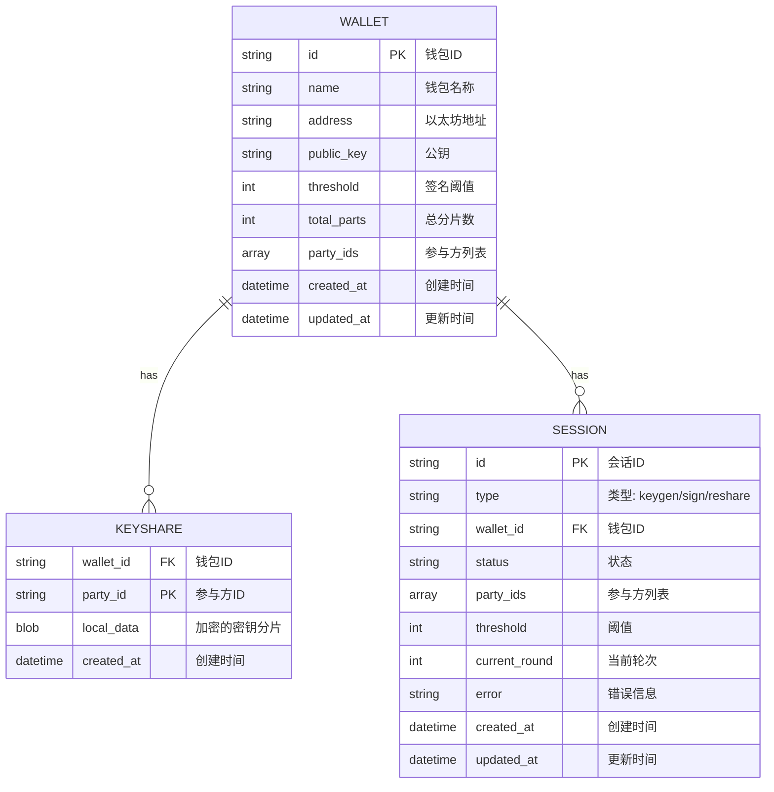

# MPC Wallet 流程图 (Mermaid)

本文档包含可渲染的 Mermaid 流程图。

> **注意**: 本项目使用 BNB Chain tss-lib，实现的是 **GG18 (Gennaro-Goldfeder 2018)** 协议，使用 Paillier 同态加密实现 MtA。

## 1. 整体系统架构

## 2. Keygen (密钥生成) 流程

## 3. Signing (签名) 流程

## 4. Resharing (密钥重分享) 流程

## 5. P2P 网络拓扑

## 6. 消息处理流程

## 7. TSS GG18 签名协议详细流程

```mermaid
flowchart TB
    subgraph "Round 1: 生成随机数和承诺"
        A1[生成随机数 k_i, γ_i] --> A2[计算 Γ_i = g^γ_i]
        A2 --> A3[计算承诺 C_i = H_Γ_i_]
        A3 --> A4[Paillier加密 c_i = Enc_k_i_]
        A4 --> A5[广播 C_i, c_i, Paillier证明]
    end
    
    subgraph "Round 2: 揭示承诺 + Paillier MtA"
        B1[验证承诺 H_Γ_j_ == C_j] --> B2[揭示 Γ_i = g^γ_i]
        B2 --> B3[执行 Paillier MtA]
        B3 --> B4[计算 D_ji = c_i^γ_j · Enc_-β_ji_]
        B4 --> B5[点对点发送 D_ji + Range Proof]
    end
    
    subgraph "Round 3: MtAwc"
        C1[验证 Range Proof] --> C2[解密得到 α_ij = k_iγ_j - β_ji]
        C2 --> C3[执行 MtAwc: k_i * w_j]
        C3 --> C4[w_j = x_j * Lagrange_j_]
    end
    
    subgraph "Round 4: 计算 δ"
        D1[δ_i = k_iγ_i + Σα_ij + Σβ_ji] --> D2[广播 δ_i]
    end
    
    subgraph "Round 5: 计算 R"
        E1[δ = Σδ_i mod q] --> E2[Γ = Πᵢ Γ_i]
        E2 --> E3[R = Γ^δ^-1 = g^1/Σk_i]
        E3 --> E4[r = R.x mod q]
    end
    
    subgraph "Round 6: 生成并聚合签名"
        F1[σ_i = k_iw_i + Σμ_ij + Σν_ji] --> F2[s_i = m·k_i + r·σ_i]
        F2 --> F3[广播 s_i]
        F3 --> F4[聚合 s = Σs_i mod q]
        F4 --> F5[验证签名有效性]
        F5 --> F6[输出签名 r, s, v]
    end
    
    A5 --> B1
    B5 --> C1
    C4 --> D1
    D2 --> E1
    E4 --> F1
```

## 8. 存储结构

---

## 使用说明

这些流程图使用 [Mermaid](https://mermaid.js.org/) 语法编写，可以在以下环境中渲染：

1. **GitHub/GitLab**: 直接在 Markdown 文件中显示
2. **VS Code**: 安装 Mermaid 预览插件
3. **在线编辑器**: [Mermaid Live Editor](https://mermaid.live/)
4. **文档工具**: Notion, Obsidian, Typora 等

如果您的环境不支持 Mermaid 渲染，请参考 `PROJECT_ARCHITECTURE.md` 中的 ASCII 流程图。
