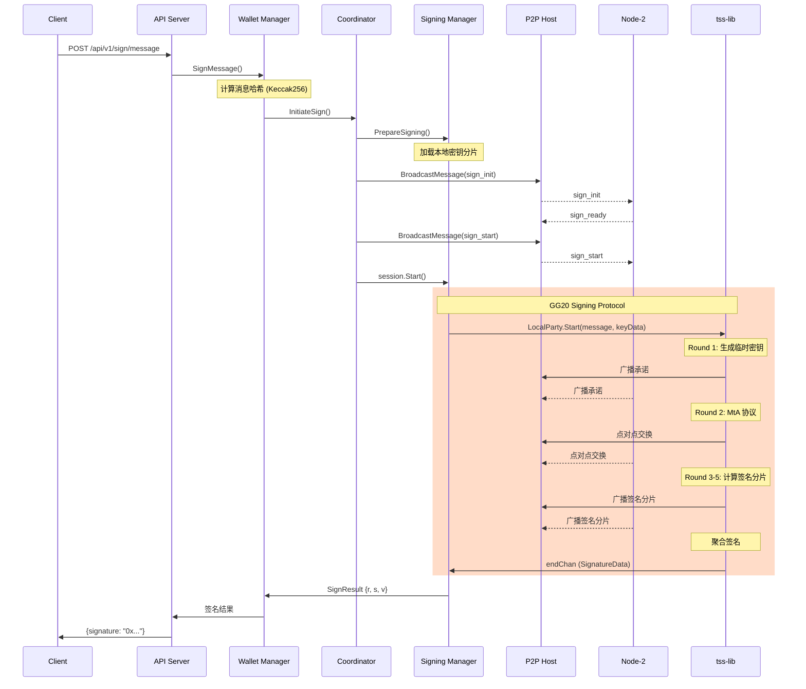
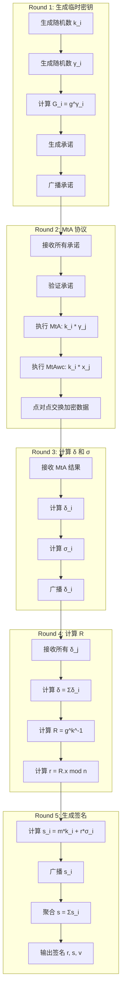

# MPC Wallet 流程图 (Mermaid)

本文档包含可渲染的 Mermaid 流程图。

## 1. 整体系统架构

## 2. Keygen (密钥生成) 流程

## 3. Signing (签名) 流程

## 4. Resharing (密钥重分享) 流程

## 5. P2P 网络拓扑

## 6. 消息处理流程

## 7. TSS GG20 签名协议详细流程

## 8. 存储结构

---

## 使用说明

这些流程图使用 [Mermaid](https://mermaid.js.org/) 语法编写，可以在以下环境中渲染：

1. **GitHub/GitLab**: 直接在 Markdown 文件中显示
2. **VS Code**: 安装 Mermaid 预览插件
3. **在线编辑器**: [Mermaid Live Editor](https://mermaid.live/)
4. **文档工具**: Notion, Obsidian, Typora 等

如果您的环境不支持 Mermaid 渲染，请参考 `PROJECT_ARCHITECTURE.md` 中的 ASCII 流程图。
